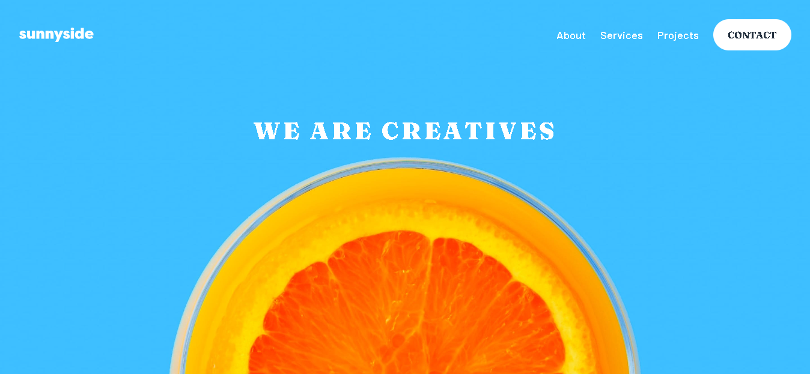

# Frontend Mentor - Sunnyside Agency Landing Page Solution

Essa é a solução para o desafio [Sunnyside Agency Landing Page do Frontend Mentor](https://www.frontendmentor.io/challenges/sunnyside-agency-landing-page-7yVs3B6ef). Frontend Mentor  é um site com desafios que ajudam a melhorar a habilidade de codificação construindo projetos reais.

## Table of contents

- [Overview](#overview)
  - [O desafio](#o-desafio)
  - [Screenshot](#screenshot)
  - [Links](#links)
- [Meu Processo](#meu-processo)
  - [Construído com](#construído-com)
  - [Recursos Úteis](#recursos-úteis)
- [Autor](#autor)

## Overview

### O desafio

O usuário deve poder:
 - Visualizar o layout de maneira otimizada dependendo do seu dispositivo (mobile, desktop, TV, etc.)
 - Visualizar os estados de todos os elementos interativos na página

### Screenshot

### Links

- Solution URL: [https://github.com/HenriqueFelixDev/sunnyside-agency-landing-page](https://github.com/HenriqueFelixDev/sunnyside-agency-landing-page)
- Live Site URL: [https://henriquefelixdev.github.io/sunnyside-agency-landing-page/](https://henriquefelixdev.github.io/sunnyside-agency-landing-page/)

## Meu Processo

### Construído com

- HTML5 semântico
- CSS customizado
- Flexbox
- CSS Grid
- Mobile-first
- BEMCSS

### Recursos Úteis

- [Meyer CSS Reset](https://meyerweb.com/eric/tools/css/reset/reset.css) - O CSS Reset permite que os elementos fiquem com a mesma aparência em diferentes navegadores.

- [BEMCSS](https://getbem.com/) - Metodologia para organização de código CSS.

## Autor

- Website - [HenriqueFelix.dev](https://henriquefelix.dev.br/)
- Frontend Mentor - [@HenriqueFelixDev](https://www.frontendmentor.io/profile/HenriqueFelixDev)
- Linkedin - [@HenriqueFelixDev](https://www.linkedin.com/in/henrique-felix-dev/)